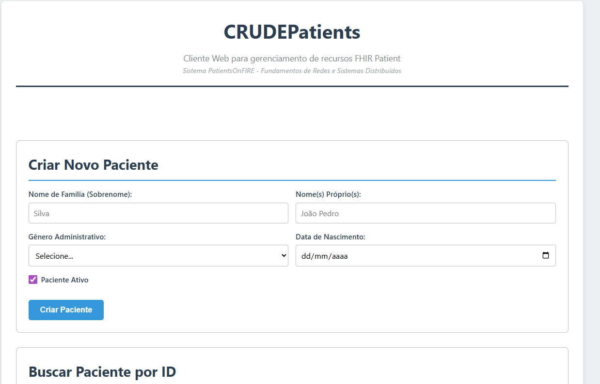
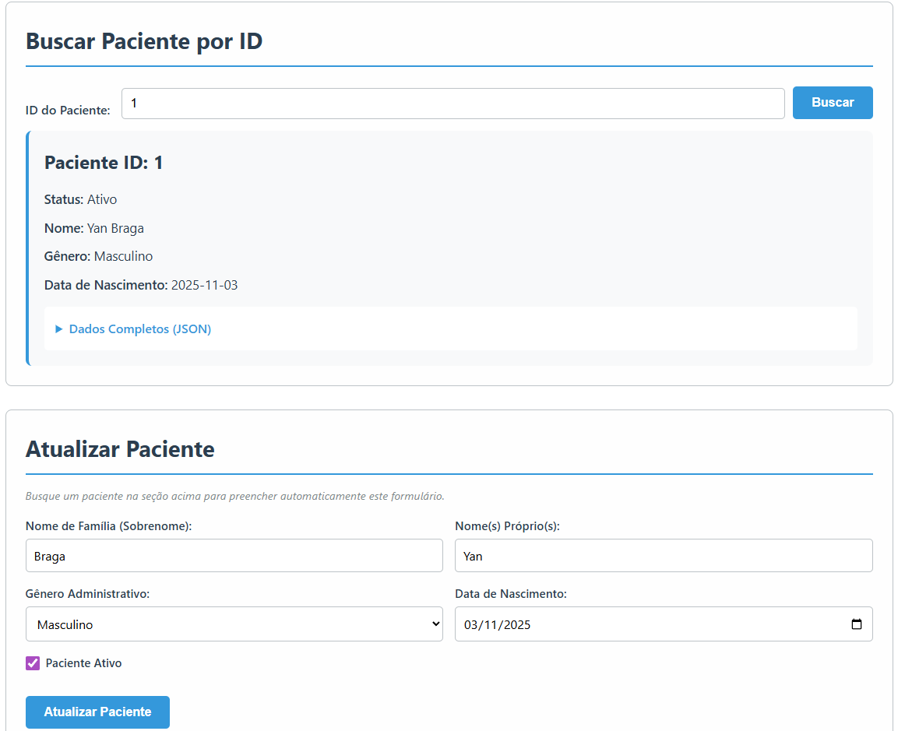
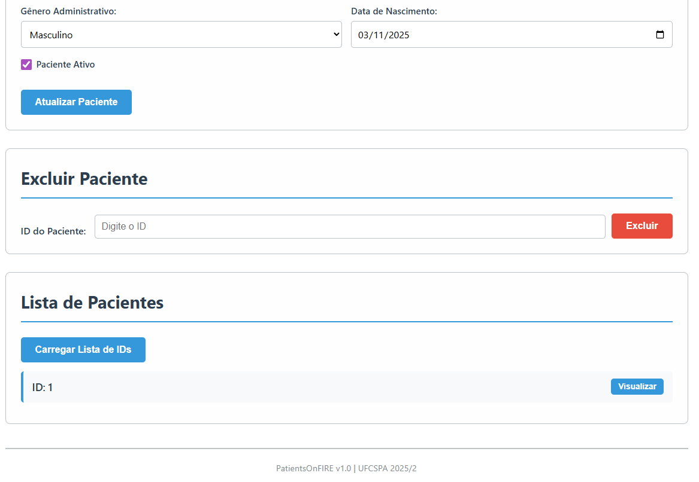

# PatientsOnFIRE - Sistema de Gerenciamento de Pacientes

Este projeto é uma implementação de um sistema distribuído cliente-servidor para gerenciamento de pacientes, desenvolvido como parte da disciplina de **Fundamentos de Redes de Computadores e Sistemas Distribuídos**.

O sistema consiste em um servidor de API RESTful (`PatientsOnFIRE`) construído com Node.js puro (sem frameworks) e uma aplicação cliente web (`CRUDEPatients`) desenvolvida com HTML, CSS e JavaScript vanilla.

O objetivo principal é aplicar os conceitos de comunicação em rede, arquitetura de serviços web e o protocolo HTTP, utilizando o padrão de interoperabilidade de saúde **HL7 FHIR** para a modelagem de dados do recurso `Patient`.

---

## 1. Arquitetura e Tecnologias

- **Backend (Servidor):**
  - **Runtime:** Node.js
  - **Tecnologia:** Módulos nativos do Node.js (`http`, `fs`, `path`, `url`).
  - **Arquitetura:** API RESTful.
  - **Persistência:** Armazenamento em memória com persistência opcional em um arquivo `patients-data.json` (configurável).

- **Frontend (Cliente):**
  - **Tecnologia:** HTML5, CSS3 e JavaScript puro (ES6+).
  - **Comunicação:** As requisições à API são feitas de forma assíncrona com a `Fetch API`.

- **Padrão de Dados:**
  - **Formato:** JSON.
  - **Schema:** Recurso `Patient` do padrão HL7 FHIR v5.0.0.

---

## 2. Estrutura do Projeto

O projeto está organizado da seguinte forma para garantir a separação de responsabilidades:

```
patients-on-fire/
├── client/         # Contém a aplicação frontend (CRUDEPatients)
│   ├── index.html  # Estrutura da página
│   ├── css/styles.css # Estilos visuais
│   └── js/
│       ├── api.js  # Lógica de comunicação com a API
│       └── ui.js   # Manipulação da interface e eventos
│
├── server/         # Contém a aplicação backend (PatientsOnFIRE)
│   ├── server.js   # Ponto de entrada e configuração do servidor HTTP
│   ├── router.js   # Roteador manual de requisições
│   ├── config.js   # Configurações do servidor (porta, host)
│   ├── controllers/ # Camada de lógica de aplicação
│   ├── models/      # Camada de modelagem e validação de dados
│   ├── repository/  # Camada de acesso e persistência de dados
│   └── utils/       # Funções utilitárias
│
├── docs/           # Documentação acadêmica e técnica do projeto
│
└── README.md       # Este arquivo
```
### Imagens de exemplo:






---

## 3. Como Configurar e Executar

Siga os passos abaixo para rodar a aplicação localmente.

### Pré-requisitos

- **Node.js:** Certifique-se de ter o Node.js instalado (versão 18.x ou superior recomendada). Você pode baixá-lo em [nodejs.org](https://nodejs.org/).

### Passos para Execução

1.  **Clone ou baixe este repositório** para a sua máquina local.
    Escolha uma pasta para guardar o projeto, então abra um terminal e execute o comando:
    ```bash
    git clone https://github.com/YBraga35/patients-on-fire.git
    ```

2.  **Inicie o Servidor:**
    Abra um terminal na pasta raiz do projeto (`patients-on-fire/`) e execute o seguinte comando:
    ```bash
    node server/server.js
    ```

3.  **Acesse a Aplicação:**
    Após iniciar o servidor, você verá uma mensagem de confirmação no terminal. Abra seu navegador de internet e acesse a seguinte URL:
    ```
    http://127.0.0.1:8080/
    ```

A aplicação cliente `CRUDEPatients` será carregada, e você poderá começar a interagir com o sistema para criar, ler, atualizar e deletar pacientes.

---

## 4. Contrato da API REST

O servidor `PatientsOnFIRE` expõe os seguintes endpoints para manipulação de recursos `Patient`:

| Operação | Método | URL | Descrição | Resposta de Sucesso |
| :--- | :--- | :--- | :--- | :--- |
| **Criar Paciente** | `POST` | `/Patient` | Cria um novo recurso de paciente. O corpo da requisição deve conter o objeto JSON do paciente. | `201 Created` com o recurso criado no corpo e o `Location` no cabeçalho. |
| **Ler Paciente** | `GET` | `/Patient/<ID>` | Retorna os dados de um paciente específico pelo seu ID. | `200 OK` com o objeto JSON do paciente. |
| **Atualizar Paciente** | `PUT` | `/Patient/<ID>` | Atualiza completamente um paciente. O corpo da requisição deve conter o objeto JSON completo. | `200 OK` com o objeto JSON atualizado. |
| **Excluir Paciente** | `DELETE` | `/Patient/<ID>` | Remove um paciente do sistema. | `204 No Content` (sem corpo na resposta). |
| **Listar IDs** | `GET` | `/PatientIDs` | Retorna uma lista com todos os IDs de pacientes existentes. | `200 OK` com um array de IDs, ex: `[1, 5, 8]`. |

### Tratamento de Erros Comuns

- `400 Bad Request`: Requisição malformada, JSON inválido ou inconsistência de dados (ex: ID na URL diferente do ID no corpo do `PUT`).
- `404 Not Found`: Recurso ou rota não encontrada.
- `500 Internal Server Error`: Erro inesperado no servidor.

---

## 5. Autores

*   *Carlise Sebastiany*
*   *Luciana Marques*
*   *Julia Boteon*
*   *Helena Tubino*
*   *Yan Braga*
